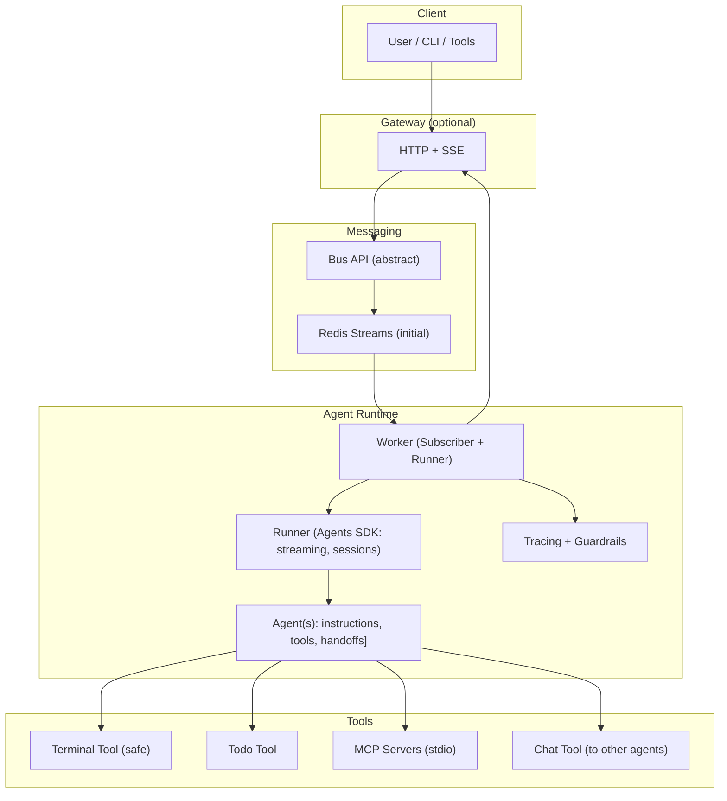

# magent2

Agent runtime using the OpenAI Agents SDK with a swappable message bus (Redis
first), streamed events, and modular tools. Small core, clean seams, easy to
extend.

## What it is

- Worker subscribes to a Bus, runs an Agents SDK Agent (streamed), and
  publishes token/tool-step/output events.
- Tools are first-class (terminal, todo, MCP, chat-to-agent) with guardrails.
- Redis Streams is the initial bus; the Bus API is abstract to allow future
  transports.
- Optional Gateway exposes HTTP POST for input and SSE for streaming output.

## Architecture



## Quickstart

Requirements: Python 3.12+, uv, Docker (for Redis)

```bash
uv venv
uv sync
cp .env.example .env  # set REDIS_URL; set OPENAI_API_KEY if using real Agents SDK
```

### Run locally with uv

- Start Redis (Compose):

```bash
just up redis
```

- Run Gateway (port 8000):

```bash
uv run uvicorn magent2.gateway.asgi:app --host 0.0.0.0 --port 8000 \
  --log-level warning --no-access-log
```

- Run Worker (echo runner by default):

```bash
uv run python -m magent2.worker
```

### Run with Docker Compose

```bash
just up
# gateway: http://localhost:8000/health
```

### Send and stream via HTTP

- Send a message:

```bash
curl -sS -X POST http://localhost:8000/send \
  -H 'content-type: application/json' \
  -d '{
    "conversation_id": "conv1",
    "sender": "user:local",
    "recipient": "agent:DevAgent",
    "type": "message",
    "content": "hello"
  }'
```

- Stream events (SSE):

```bash
curl -N http://localhost:8000/stream/conv1
```

## Development

- Lint/format: `uv run ruff check` / `uv run ruff format`
- Types: `uv run mypy`
- Tests: `uv run pytest -q`
- Pre-commit (staged files): `uv run pre-commit run`
- Full local quality gate: `just check`

## Entry points

- Gateway ASGI app: `magent2.gateway.asgi:app`
- Worker module: `python -m magent2.worker`

## Configuration

Environment variables:

- `REDIS_URL` (default `redis://localhost:6379/0` or compose service URL)
- `AGENT_NAME` (worker target agent; default `DevAgent`)
- `OPENAI_API_KEY` (required if using real Agents SDK models/tools)

## Contracts

Frozen contracts (v1) for parallel work:

- Message envelope and stream events: `magent2/models/envelope.py`
- Bus API: `magent2/bus/interface.py`

See `docs/CONTRACTS.md`.

## Parallel workflow

- Follow `docs/PARALLEL_WORK.md` for branch naming, ownership, and TDD
  expectations.
- Always reference an issue number in commit messages.

## Status

- Core runtime, gateway, worker, tools, and tests are in place.
- Compose images build locally with healthchecks; SSE streaming works.
