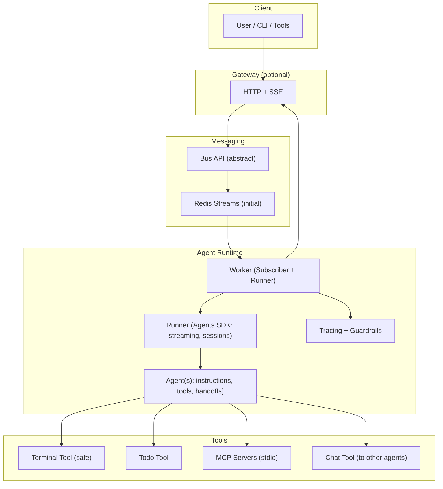

# magent2

Agent runtime using the OpenAI Agents SDK with a swappable message bus (Redis first), streamed events, and modular tools. Small core, clean seams, easy to extend.

## What it is

- Worker subscribes to a Bus, runs an Agents SDK Agent (streamed), and publishes token/tool-step/output events.
- Tools are first-class (terminal, todo, MCP, chat-to-agent) with guardrails.
- Redis Streams is the initial bus; the Bus API is abstract to allow future transports.
- Optional Gateway exposes HTTP POST for input and SSE for streaming output.

## Architecture



## Quickstart

Requirements: Python 3.12+, uv, Docker (for Redis)

```bash
uv venv
uv sync
cp .env.example .env  # set OPENAI_API_KEY and REDIS_URL if using Redis
# start Redis (optional for local dev using compose)
docker compose up -d

# run tests
uv run pytest
```

## Development

- Lint/format: `uv run ruff check` / `uv run ruff format`
- Types: `uv run mypy`
- Pre-commit (staged files): `pre-commit run`

## Contracts

Frozen contracts (v1) for parallel work:

- Message envelope and stream events: `magent2/models/envelope.py`
- Bus API: `magent2/bus/interface.py`

See `docs/CONTRACTS.md`.

## Parallel workflow

- Follow `docs/PARALLEL_WORK.md` for branch naming, ownership, and TDD expectations.
- Always reference an issue number in commit messages and PRs.

## Status

- Core contracts and tests exist. Safe to start in parallel on:
  - Worker (streaming + sessions)
  - Redis adapter for Bus
  - Tools (terminal, todo, MCP)
  - Optional Gateway
  - Observability
