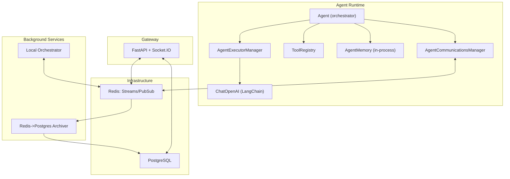
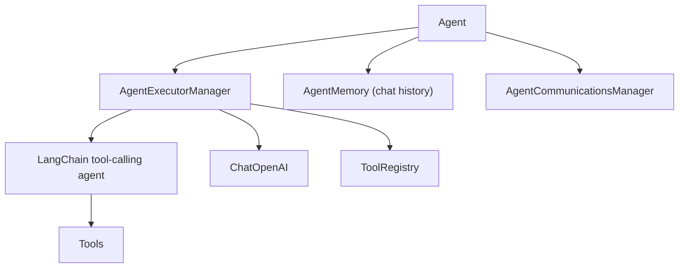
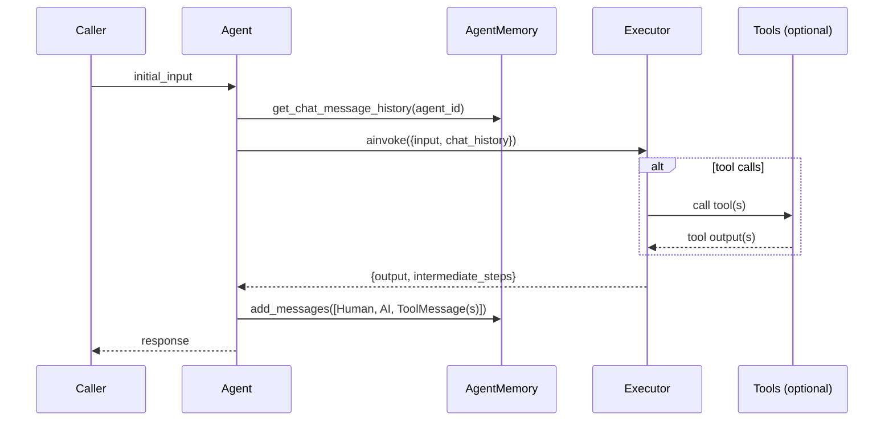
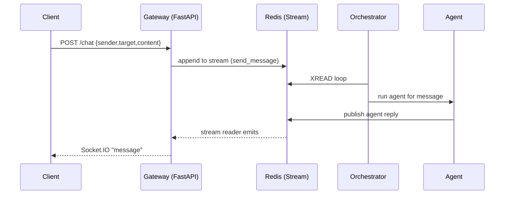

# MAgent

Multi-agent development framework with LangChain-powered agents, real-time Redis messaging, a FastAPI + Socket.IO gateway, and PostgreSQL persistence. This README reflects the current minimal, production‑focused status.

## What it is (current status)

- Agents run locally, use tools, and communicate over Redis.
- A FastAPI gateway exposes HTTP and WebSocket endpoints for control and streaming.
- PostgreSQL stores durable state (via supporting services); Redis carries live events and message streams.
- Agent chat history is in‑process only (no external memory service).
- Tests cover unit, integration, and contract compatibility.

## Architecture



### Agent internals



### Agent run sequence



### Gateway chat sequence



Key components:

- `magent/agent_core/…`: agent orchestration, LangChain executor, tools, Redis comms
- `magent/gateway/fastapi_app.py`: async gateway (HTTP + WebSocket)
- `magent/services/postgres_manager.py`: asyncpg pool and CRUD helpers

## Requirements

- Python 3.12+
- uv (dependency and venv manager)
- Docker (for local infrastructure)

## Setup

1. Clone and create environment

```bash
git clone <repo-url>
cd magent
uv venv
uv sync
```

1. Configure env vars

- Copy `.env.example` to `.env` and set required variables (LLM keys, Redis/Postgres URLs). The application fails fast if required variables are missing.

1. Start local infrastructure (Redis, Postgres, etc.)

```bash
docker compose -f infra/docker/docker-compose.yml up --build --detach
```

## Run

- Local dev (default port 8000):

```bash
uv run uvicorn magent.gateway.fastapi_app:sio_app --reload --port 8000
```

- Docker (gateway exposes 5000 per compose):

```bash
docker compose -f infra/docker/docker-compose.yml up --build --detach
# Gateway health: http://localhost:5000/health
```

- Interact with an agent (simple chat loop):

```bash
uv run python scripts/interactive_chat.py --agent-name DevAgent
```

## Testing

```bash
# unit + integration
uv run pytest

# contract tests
uv run pytest tests/contract -m contract

# coverage
uv run pytest --cov=magent
```

## Contract testing

Consumer-driven contracts (Pact) verify compatibility across agent/gateway/Redis integrations. Contract tests live under `tests/contract/{consumer,provider}` and run with the `contract` marker.

```bash
uv run pytest tests/contract -m consumer
uv run pytest tests/contract -m provider
```

## Development

Linting and type checks:

```bash
uv run ruff check
uv run mypy
```

Pre-commit on staged files:

```bash
pre-commit run
```

## Minimal file map

```text
magent/
  agent_core/
    agent.py               # Agent orchestration
    agent_executor.py      # LangChain executor setup
    memory.py              # In‑process chat history
    tool_registry.py       # Tool loading/validation
    tools/                 # Built-in tools (fs, comms, etc.)
    redis_comms/           # Redis broker + SDK
  gateway/
    fastapi_app.py         # FastAPI + Socket.IO (ASGI app)
  services/
    postgres_manager.py    # Async PostgreSQL access
    redis_archiver.py      # Redis stream to Postgres archiver
scripts/
  interactive_chat.py
  run_orchestrator.py
tests/
  contract/                # Pact consumer/provider tests
```

## Infra notes

- Docker images use multi-stage builds and define health checks.
- Use the compose file under `infra/docker/docker-compose.yml` for local dev.
- Env var schema mirrors `.env.example`.

## Status & decisions

- External/shared memory service removed; agent uses in‑process chat history only.
- Communications remain via Redis (optional if you don’t run the gateway/orchestrator).
- Keep agent minimal; no speculative features (YAGNI).
