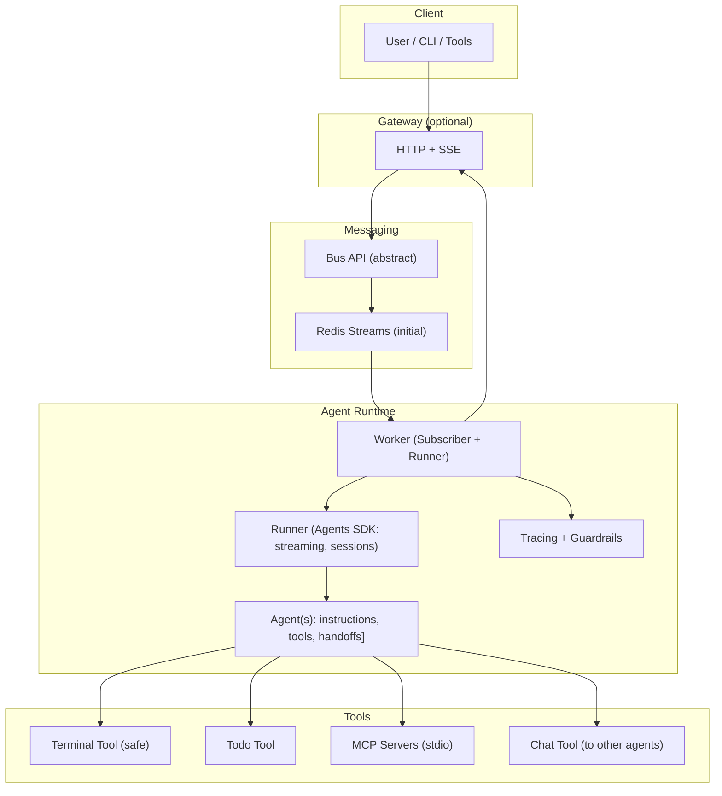

# magent2

Agent runtime using the OpenAI Agents SDK with a swappable message bus (Redis
first), streamed events, and modular tools. Small core, clean seams, easy to
extend.

## What it is

- Worker subscribes to a Bus, runs an Agents SDK Agent (streamed), and
  publishes token/tool-step/output events.
- Tools are first-class (terminal, todo, MCP, chat-to-agent) with guardrails.
- Redis Streams is the initial bus; the Bus API is abstract to allow future
  transports.
- Optional Gateway exposes HTTP POST for input and SSE for streaming output.

See orchestration guidance: `docs/ORCHESTRATION.md`.

## Architecture



## Quickstart

Requirements: Python 3.12+, uv, Docker (for Redis)

```bash
uv venv
uv sync
cp .env.example .env  # set REDIS_URL; set OPENAI_API_KEY if using real Agents SDK
```

### Run locally without Docker (no external services)

- Single process (gateway + worker, in‑memory bus):

```bash
uv venv
uv sync
just local
# gateway: http://localhost:8000/health
```

Notes:

- This mode uses a thread‑safe in‑process bus, so no Redis is required.
- If `OPENAI_API_KEY` is set, the worker uses the OpenAI Agents SDK; otherwise it runs the Echo runner.

### Run locally with uv

- Start Redis (Compose):

```bash
just up redis
```

- Run Gateway (port 8000):

```bash
uv run uvicorn magent2.gateway.asgi:app --host 0.0.0.0 --port 8000 \
  --log-level warning --no-access-log
```

- Run Worker (echo runner by default):

```bash
uv run python -m magent2.worker
```

### Run with Docker Compose

```bash
just up
# gateway: http://localhost:8000/health
```

Ports and parallel stacks:

- Dev defaults: `GATEWAY_PORT=8000`, `REDIS_PORT=6379` (from compose)
- Test defaults: `GATEWAY_PORT=18000`, `REDIS_PORT=16379` (set by pytest fixtures)
- Run dev and tests in parallel using a separate project name for tests:

```bash
# Dev stack (default ports)
docker compose up -d

# Test stack (fixed non-conflicting ports and project name)
GATEWAY_PORT=18000 REDIS_PORT=16379 docker compose -p magent2_test up -d

# Or let pytest manage bringing the stack up with its project name
uv run pytest -q -m docker tests/e2e -q
```

### Send and stream via HTTP

- Send a message:

```bash
curl -sS -X POST http://localhost:8000/send \
  -H 'content-type: application/json' \
  -d '{
    "conversation_id": "conv1",
    "sender": "user:local",
    "recipient": "agent:DevAgent",
    "type": "message",
    "content": "hello"
  }'
```

- Stream events (SSE):

```bash
curl -N http://localhost:8000/stream/conv1
```

## Development

- Lint/format: `uv run ruff check` / `uv run ruff format`
- Types: `uv run mypy`
- Tests: `uv run pytest -q`
- Pre-commit (staged files): `uv run pre-commit run`
- Full local quality gate: `just check`

### Logs (developer UX)

- Interactive logs across all containers:

```bash
just log
```

Requires LazyDocker. Install: <https://github.com/jesseduffield/lazydocker#installation>

### Client CLI (one-shot and streaming)

Send a single message and exit after the final output:

```bash
magent2 client \
  --message "hello" \
  --conv conv-123 \
  --agent DevAgent \
  --sender user:local \
  --base-url auto \
  --timeout 60
```

Notes:

- `--base-url auto` attempts to discover the Gateway port from Docker Compose; falls back to `http://localhost:8000`.
- Exit codes: `0` ok, `2` timeout, `3` send failed, `4` stream connect failed, `5` usage.
- The client renders streamed events including tool steps and `[log][LEVEL] component: message` entries.

Flags:

```bash
# Adjust server log rendering threshold (default info)
--log-level {debug,info,warning,error}

# Output modes (mutually exclusive):
--quiet            # only the final output line
--json             # one compact JSON object per SSE event line

# Limit events processed (also passed as query param to the stream URL)
--max-events N
```

Examples:

```bash
# JSON mode for machine parsing
magent2 client --message "ping" --json --timeout 10

# Quiet mode for shell scripting
magent2 client --message "ping" --quiet --timeout 10

# Stream only first 5 events
magent2 client --conv conv-1 --max-events 5
```

## Todo function tools

Agents SDK function tools backed by a Redis store:

- `todo_create(conversation_id: str, title: str, metadata: dict | None = None)` → `{ "task": { ... } }`
- `todo_get(task_id: str)` → `{ "task": { ... } }` or `{ "task": null }`
- `todo_list(conversation_id: str)` → `{ "tasks": [ { ... }, ... ] }`
- `todo_update(task_id: str, *, title: str | None = None, completed: bool | None = None, metadata: dict | None = None)` → `{ "task": { ... } }` or `{ "task": null }`
- `todo_delete(task_id: str)` → `{ "ok": bool }`

Notes:

- Task objects are JSON-safe via `model_dump(mode="json")` (RFC3339 datetimes).
- On transient Redis errors, tools return a compact error shape, e.g., `{ "task": null, "error": "...", "transient": true }`.

Environment:

- `REDIS_URL` (required at runtime; tests use Docker-based Redis via `pytest-docker`).
- `TODO_STORE_PREFIX` (optional, defaults to `todo`) to isolate keys per environment/test.

## Entry points

- Gateway ASGI app: `magent2.gateway.asgi:app`
- Worker module: `python -m magent2.worker`

### Top-level CLI

After syncing deps, the CLI provides simple workflows:

```bash
# Launch the Rust TUI (ensures stack if needed)
just tui

# Launch Python client directly (headless streaming client)
magent2 client --base-url auto --agent DevAgent
```

> **Note:** the legacy `magent2` CLI entry point is temporarily a placeholder
> while we design headless automation workflows. Track progress in
> issue #159.

Environment variables:

- `MAGENT2_BASE_URL` (default `http://localhost:8000`) used by Python client and Rust TUI
- `MAGENT2_AGENT_NAME` (default `DevAgent`) used by Rust TUI

### Rust TUI (experimental)

A minimal Ratatui-based terminal UI lives in `chat_tui/`.

```bash
# Build/run the TUI (requires Rust toolchain)
cd chat_tui
cargo run
```

See `docs/FRONTEND_TUI.md` for a complete tour, keybindings, and observer API
details.

Features:

- Multi-session tabs (`Tab` to switch, `F2` new session)
- Paste support and enhanced key handling
- Streams from `/stream/{conversation_id}` and posts via `/send`
- Conversations panel: `Ctrl+C` toggle, `Shift+Tab` focus, Up/Down/PageUp/PageDown to select (when focused), `Ctrl+R` refresh, `Enter` to switch (stops old SSE, starts new)
- Focus indicators flag the active panel (`[FOCUS]` in titles) and the input footer shows the terminal cursor where typing will land
- Markdown-aware rendering for agent messages (lists, paragraphs)
- Toggle a tools pane (`F3`) that renders `tool_step` events (planned)

Notes:

- Use `just tui` to spin up the stack and launch the Rust TUI when `chat_tui/`
  is present.
- The `magent2` CLI entry point is under redesign (see issue #159) and currently
  only exposes the streaming client directly.

## Configuration

Environment variables:

- `REDIS_URL` (default `redis://localhost:6379/0` or compose service URL)
  - When using Docker Compose, internal service URLs are fixed (`redis://redis:6379/0`).
  - Host ports are configurable via `GATEWAY_PORT` and `REDIS_PORT`.
- `AGENT_NAME` (worker target agent; default `DevAgent`)
- `AGENT_MODEL` (Agents SDK model name, e.g., `gpt-4o-mini`; default `gpt-4o-mini`)
- `AGENT_INSTRUCTIONS` (inline agent instructions; optional)
- `AGENT_INSTRUCTIONS_FILE` (path to a file with agent instructions; overrides `AGENT_INSTRUCTIONS`)
- `AGENT_TOOLS` (comma-separated tool names for allowlist; when set, only specified tools are available to the agent)
- `AGENT_REQUIRE_EXPLICIT_TOOLS` (set to `1` for production hardening; when true, agents have no tools unless explicitly allowlisted via `AGENT_TOOLS`)
- `OPENAI_API_KEY` (if set, the Worker uses the OpenAI Agents SDK runner; if unset, it falls back to EchoRunner for local/dev)

### Tool Configuration Examples

Configure agent tools via environment variables:

```bash
# Development: Allow specific tools only
AGENT_TOOLS="terminal,todo" uv run python -m magent2.worker

# Production hardening: Require explicit tool allowlist
AGENT_REQUIRE_EXPLICIT_TOOLS=1 AGENT_TOOLS="terminal,todo" uv run python -m magent2.worker

# Allow all available tools (default development behavior)
# No AGENT_TOOLS needed - agent gets all detected tools
uv run python -m magent2.worker
```

**Tool Discovery Behavior:**

- **With `AGENT_TOOLS`**: Only specified tools are available; unknown tools are logged and skipped
- **With `AGENT_REQUIRE_EXPLICIT_TOOLS=1`**: No tools available unless explicitly allowlisted
- **Default**: All detected tools are available (development convenience)

**Implementation References:**

- Tool configuration parsing: `magent2/runner/config.py` (`_read_tools()`)
- Tool discovery and resolution: `magent2/tools/registry.py` (`discover_tools()`)
- Environment variable handling: `magent2/tools/registry.py` (`_env_true()`)

Sessions:

- The runner uses a single session strategy across environments:
  - If `SQLiteSession` is available in the installed Agents SDK, it persists conversation history to a local SQLite file at `AGENT_SESSION_PATH`.
  - If `SQLiteSession` is unavailable, runs proceed without persistence (history is not stored).
- `AGENT_SESSION_PATH` (default `./.sessions/agents.db`) controls the SQLite file location. The directory is created on demand.
- `*.db` files and the `.sessions/` directory are ignored by git.

At startup, the Worker selects the runner based on `OPENAI_API_KEY` and logs the choice (Echo vs OpenAI) with the agent name/model.

### Terminal tool (policy via env)

- `TERMINAL_ALLOWED_COMMANDS`: comma‑separated list of allowed command basenames (e.g., `echo,bash,python3`). Default: comprehensive set including common utilities, text processing, system info, development tools, and file operations. Set to empty string to deny all commands.
- `TERMINAL_TIMEOUT_SECONDS`: float seconds before forceful termination. Default: `5.0`.
- `TERMINAL_OUTPUT_CAP_BYTES`: byte cap for combined stdout/stderr enforced by the low‑level tool. Default: `8192`.
- `TERMINAL_FUNCTION_OUTPUT_MAX_CHARS`: character cap for the concise string returned to the model. Default: `1000`.
- `TERMINAL_REDACT_SUBSTRINGS`: comma‑separated substrings to redact in outputs.
- `TERMINAL_REDACT_PATTERNS`: comma‑separated regex patterns to redact in outputs (built‑ins always applied: `sk-[A-Za-z0-9_-]{10,}` and common sensitive labels).

## Contracts

Frozen contracts (v1) for parallel work:

- Message envelope and stream events: `magent2/models/envelope.py`
- Bus API: `magent2/bus/interface.py`

See `docs/CONTRACTS.md`.

## Parallel workflow

- Follow `docs/PARALLEL_WORK.md` for branch naming, ownership, and TDD
  expectations.
- Always reference an issue number in commit messages and PRs.

## Status

- Core runtime, gateway, worker, tools, and tests are in place.
- Compose images build locally with healthchecks; SSE streaming works.
